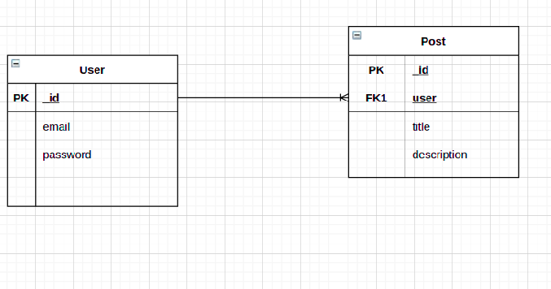

# express-typescript
This project is a a demo workoing directroy for practicing Typescript with node, express and MongoDB.

# About this project
1. Uses typescript
2. Uses Node and express for routing
3. Uses MongoDB's no schema database

# Requirements
[Node js](https://nodejs.org/en/download/)
[MongoDb](https://docs.mongodb.com/manual/installation/)

# SDK's Used in this project
1. Mongoose

# Installation Instructions
`npm install`

`Create a .env file with Database configurations`

# Running on local
To start run this:
`npm run dev`
# Database Design
1. This is relational database design
2. Models are defined in src/models

